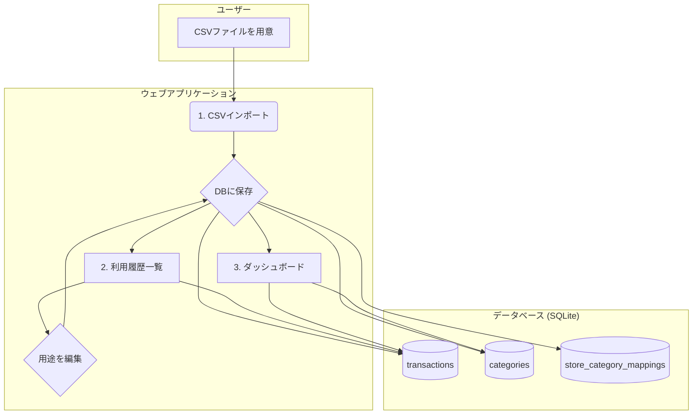
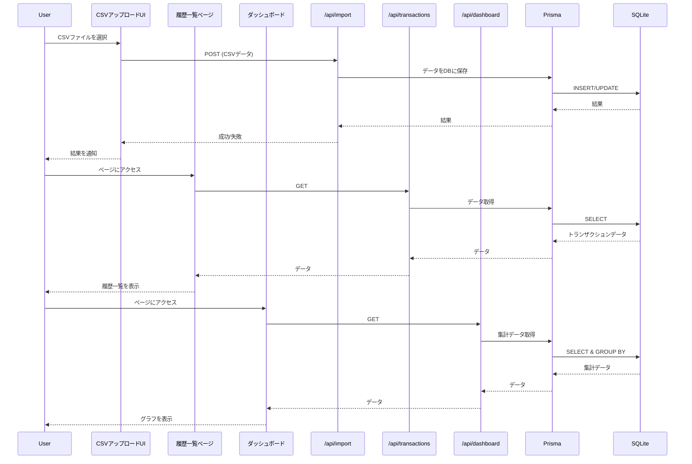

# プロジェクト名: クレジットカード利用明細ダッシュボード

## 1. 概要

クレジットカードの利用明細CSVをインポートし、内容をデータベースに保存。ユーザーが利用履歴を閲覧・編集し、支出を視覚的に分析できるウェブアプリケーション。

## 2. 技術スタック

*   **フロントエンド:** Next.js, TypeScript
*   **バックエンド:** Next.js (API Routes), TypeScript
*   **データベース:** SQLite
*   **UIライブラリ:** （未定 - Chakra UIやMUIなどを想定）
*   **グラフ描画:** （未定 - Chart.jsやD3.jsなどを想定）

## 3. 機能要件

1.  **CSVインポート機能**
    *   ユーザーは指定されたフォルダにあるCSVファイルをアップロード（またはシステムが自動で読み込み）。
    *   システムはCSVデータをパースし、データベースに保存する。
    *   重複データは適切に処理する（例：同じ日付・店名・金額のデータは登録しない）。

2.  **利用履歴一覧・編集機能**
    *   データベースに保存された利用履歴を一覧で表示する。
    *   一覧には「利用日」「利用店名」「利用金額」などを表示する。
    *   ユーザーは各履歴に対して「用途（カテゴリ）」を登録・編集できる。
    *   ユーザーは「店名」と「用途」を紐づけて登録できる（例：「〇〇スーパー」は「食費」）。一度紐づけると、次回以降のCSVインポート時に同じ店名の履歴には自動で「食費」が割り当てられる。

3.  **ダッシュボード機能**
    *   月ごとの合計利用金額を表示する。
    *   用途（カテゴリ）別の支出割合を円グラフなどで視覚的に表示する。
    *   期間を指定してデータをフィルタリングできる。

## 4. データベース設計（案）

CSVファイルの内容を分析した結果、以下の設計に更新します。支払月ごとのサマリー情報を保持する `statements` テーブルを追加し、利用明細と紐付けます。

*   **`statements` テーブル** (支払明細サマリー)
    *   `id` (INTEGER, PRIMARY KEY)
    *   `payment_date` (TEXT) - 支払日 (例: "2025/01/10")
    *   `total_amount` (INTEGER) - 支払金額合計
    *   `imported_at` (TEXT) - インポート日時
    *   `created_at` (TEXT)
    *   `updated_at` (TEXT)

*   **`transactions` テーブル** (利用明細)
    *   `id` (INTEGER, PRIMARY KEY)
    *   `statement_id` (INTEGER, FOREIGN KEY to `statements.id`) - 支払明細サマリーID
    *   `transaction_date` (TEXT) - 利用日
    *   `store_name` (TEXT) - 利用店名
    *   `amount` (INTEGER) - 利用金額
    *   `payment_type` (TEXT) - 支払区分 (例: "１回")
    *   `note` (TEXT, NULLABLE) - 摘要
    *   `category_id` (INTEGER, FOREIGN KEY to `categories.id`) - 用途カテゴリ
    *   `created_at` (TEXT)
    *   `updated_at` (TEXT)

*   **`categories` テーブル** (用途カテゴリ)
    *   `id` (INTEGER, PRIMARY KEY)
    *   `name` (TEXT, UNIQUE) - カテゴリ名 (例: 食費, 交通費)
    *   `created_at` (TEXT)
    *   `updated_at` (TEXT)

*   **`store_category_mappings` テーブル** (店名とカテゴリの紐付け)
    *   `id` (INTEGER, PRIMARY KEY)
    *   `store_name` (TEXT, UNIQUE) - 利用店名
    *   `category_id` (INTEGER, FOREIGN KEY to `categories.id`) - 用途カテゴリ
    *   `created_at` (TEXT)
    *   `updated_at` (TEXT)

## 5. 開発ステップ（案）

1.  **Step 1: プロジェクトセットアップ**
    *   Next.js (TypeScript) プロジェクトの作成。
    *   必要なライブラリ（Prisma (ORM), UIライブラリ, etc.）の導入。
    *   SQLiteデータベースファイルの初期設定。

2.  **Step 2: データベーススキーマ定義とマイグレーション**
    *   Prismaを使って上記データベーススキーマを定義。
    *   マイグレーションを実行し、テーブルを作成。

3.  **Step 3: CSVインポートAPIの実装**
    *   CSVファイルを読み込み、パースするAPIエンドポイントをNext.jsのAPI Routesで作成。
    *   パースしたデータをデータベースに保存するロジックを実装。
    *   店名とカテゴリの紐付けロジックを実装。

4.  **Step 4: フロントエンドUIの実装**
    *   利用履歴一覧ページの作成。
    *   カテゴリ登録・編集モーダル（またはページ）の作成。
    *   ダッシュボードページの作成（グラフ描画含む）。
    *   CSVアップロード用のUIを作成。

5.  **Step 5: API連携とテスト**
    *   フロントエンドとバックエンドAPIを連携。
    *   一連の機能（CSVインポート → データ表示 → 編集 → ダッシュボード反映）の動作確認。
    *   単体テスト・結合テストの実装（必要に応じて）。

## 6. Mermaid ダイアグラム



## 7. 詳細実装計画

### **Step 1: プロジェクトセットアップ**

1.  **Next.jsプロジェクト作成:**
    ```bash
    npx create-next-app@latest jcb-dashboard --typescript --eslint --app-router --src-dir --import-alias "@/*"
    cd jcb-dashboard
    ```
2.  **Prisma (ORM) の導入と設定:**
    ```bash
    npm install prisma --save-dev
    npm install @prisma/client
    npx prisma init --datasource-provider sqlite
    ```
    これにより `prisma/schema.prisma` と `.env` ファイルが生成されます。`.env` には `DATABASE_URL="file:./dev.db"` が設定されます。

3.  **UIライブラリ (Chakra UI) の導入:**
    ```bash
    npm install @chakra-ui/react @emotion/react @emotion/styled framer-motion
    ```
    導入後、`app/providers.tsx` を作成し、アプリケーション全体を `ChakraProvider` でラップします。

4.  **グラフライブラリ (Chart.js) の導入:**
    ```bash
    npm install chart.js react-chartjs-2
    ```

5.  **CSVパースライブラリ (Papa Parse) の導入:**
    ```bash
    npm install papaparse
    npm install @types/papaparse --save-dev
    ```

### **Step 2: データベーススキーマ定義とマイグレーション**

1.  **`prisma/schema.prisma` の編集:**
    `PLAN.md` の設計に基づき、モデルを定義します。

    ```prisma
    // This is your Prisma schema file,
    // learn more about it in the docs: https://pris.ly/d/prisma-schema

    generator client {
      provider = "prisma-client-js"
    }

    datasource db {
      provider = "sqlite"
      url      = env("DATABASE_URL")
    }

    model Statement {
      id           Int      @id @default(autoincrement())
      payment_date DateTime
      total_amount Int
      imported_at  DateTime @default(now())
      transactions Transaction[]
      created_at   DateTime @default(now())
      updated_at   DateTime @updatedAt
    }

    model Transaction {
      id               Int      @id @default(autoincrement())
      transaction_date DateTime
      store_name       String
      amount           Int
      payment_type     String
      note             String?
      created_at       DateTime @default(now())
      updated_at       DateTime @updatedAt
      category         Category? @relation(fields: [categoryId], references: [id])
      categoryId       Int?
      statement        Statement @relation(fields: [statementId], references: [id])
      statementId      Int
    }

    model Category {
      id           Int           @id @default(autoincrement())
      name         String        @unique
      transactions Transaction[]
      mappings     StoreCategoryMapping[]
      created_at   DateTime      @default(now())
      updated_at   DateTime      @updatedAt
    }

    model StoreCategoryMapping {
      id         Int      @id @default(autoincrement())
      store_name String   @unique
      category   Category @relation(fields: [categoryId], references: [id])
      categoryId Int
      created_at DateTime @default(now())
      updated_at DateTime @updatedAt
    }
    ```

2.  **マイグレーションの実行:**
    スキーマをデータベースに反映させます。
    ```bash
    npx prisma migrate dev --name init
    ```
    これにより、`prisma/migrations` ディレクトリと `dev.db` ファイルが作成されます。

### **Step 3: API (バックエンド) の実装**

`app/api/` ディレクトリ以下に、各エンドポイントを作成します。

1.  **CSVインポートAPI (`app/api/import/route.ts`):**
    *   `POST` メソッドを処理します。
    *   リクエストボディからCSVデータ（テキスト形式）を受け取ります。
    *   **CSVパース処理:**
        *   受け取ったCSVテキストから、ヘッダー部分（1〜5行目）と明細部分を分離します。
        *   ヘッダー部分から「今回のお支払日」「今回のお支払金額合計」を抽出し、`statements` テーブルに保存します。
        *   明細部分（6行目以降）を `papaparse` でパースします。6行目がカラム名になるように設定します。（`header: true`）
        *   パースした各行のデータについて、以下の処理を行います。
            *   `ご利用日` (`transaction_date`), `ご利用先など` (`store_name`), `お支払い金額(￥)` (`amount`), `支払区分` (`payment_type`), `摘要` (`note`) を取得します。
            *   金額の文字列からカンマを除去し、数値に変換します。
            *   `Prisma Client` を使って `Transaction` テーブルに登録します。この際、先に作成した `statements` のIDと紐付けます。
    *   `StoreCategoryMapping` を参照し、店名が一致すれば自動でカテゴリを紐付けます。
    *   重複チェックロジックを実装します（例: 同じ `statement_id` 内で、同じ `transaction_date`, `store_name`, `amount` のデータは登録しない）。

2.  **利用履歴API (`app/api/transactions/route.ts` と `app/api/transactions/[id]/route.ts`):**
    *   `GET /api/transactions`: 全ての利用履歴を返す。支払月 (`statement_id`) でフィルタリングできるようにする。
    *   `PUT /api/transactions/[id]`: 指定された履歴のカテゴリを更新する。

3.  **ダッシュボード用集計API (`app/api/dashboard/route.ts`):**
    *   `GET` メソッドを処理します。
    *   Prismaの `groupBy` と `aggregate` を使用して、カテゴリ別・月別の合計金額を計算して返します。

### **Step 4: UI (フロントエンド) の実装**

1.  **CSVアップロードコンポーネント (`app/components/CsvUploader.tsx`):**
    *   `<input type="file">` を設置し、ファイル選択をハンドリングします。
    *   選択されたファイルを `FileReader` で読み込み、`/api/import` へ送信する機能を実装します。

2.  **利用履歴一覧ページ (`app/transactions/page.tsx`):**
    *   サーバーコンポーネント内で `Prisma Client` を直接、またはクライアントコンポーネントで `useEffect` と `fetch` を使って `/api/transactions` からデータを取得します。
    *   `Chakra UI` の `Table` を使ってデータを表示します。
    *   各行にカテゴリ編集用のモーダルを開くボタンを設置します。

3.  **ダッシュボードページ (`app/page.tsx`):**
    *   `/api/dashboard` から集計データを取得します。
    *   `react-chartjs-2` を使い、取得したデータを円グラフや棒グラフで描画します。

### **コンポーネント連携のシーケンス図**

